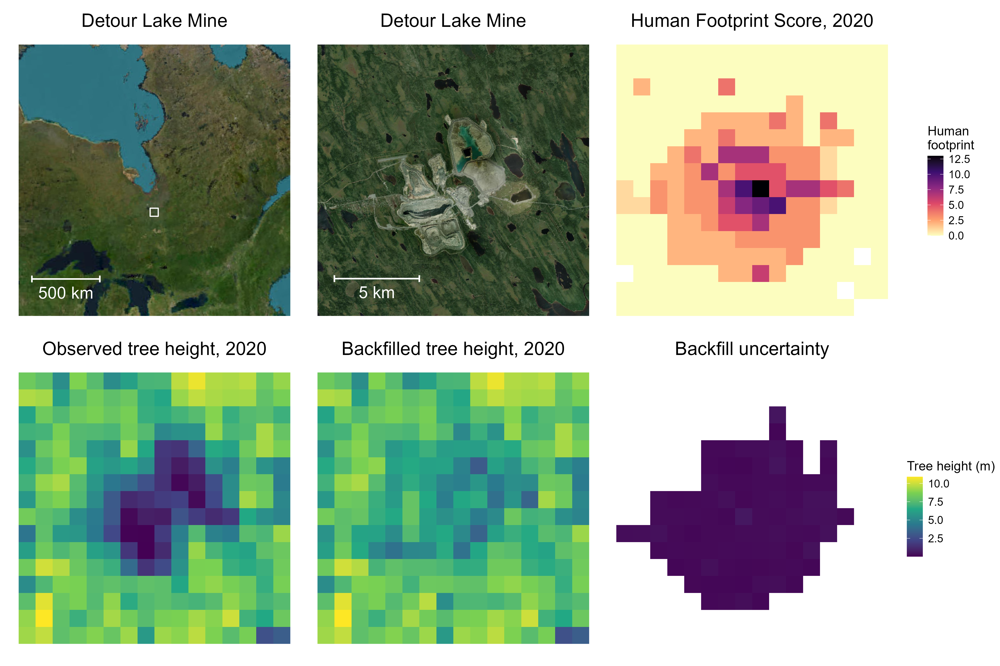

# Impact Assessment of Industrial Human Footprint on Boreal Birds

## Objective

This project estimates the **counterfactual effect of industrial human footprint
(HF) on bird populations** across the Canadian boreal. Rather than asking "where
do birds occur today?", we ask: *how many birds would there be, and where, if
industry had never altered the landscape?* The difference between observed and
counterfactual populations — partitioned by industrial sector (e.g. forestry,
mines, roads, energy) — quantifies the population-level impact attributable to
each sector.

## Collaborating Institutions

- **University of Alberta**
- **Boreal Avian Modelling Centre (BAM)**
- **Environment and Climate Change Canada (ECCC)**

## Methods

The pipeline proceeds in three stages:

1. **Backfill biotic covariates.** Within each Level-6 hydrological subbasin
   (~674 across the Canadian boreal), low-HF pixels are used to train
   [Bayesian Additive Regression Tree](https://cran.r-project.org/package=BART)
   (BART) models that predict biotic covariates (tree height, canopy cover,
   land cover, etc.) from abiotic covariates (climate, soil, terrain). These
   models are then applied to high-HF pixels to predict what the vegetation
   *would have been* in the absence of industry — removing the imprint of human
   footprint from the covariate stack.

2. **Re-predict bird density.** BAM's V5 boosted regression tree (BRT) bird
   models are re-run on the backfilled covariate stack. Joint sampling nests
   BART posterior draws inside BRT bootstrap iterations so that uncertainty
   from both the vegetation model and the bird model propagates coherently.

3. **Attribute impact by sector.** Because sector impacts are not additive
   (roads + mines ≠ roads alone + mines alone), we enumerate all
   2⁸ = 256 sector coalitions and compute **exact Shapley values** that
   partition the total HF impact among the 8 industrial sectors. Estimates are
   aggregated bottom-up: subbasin → BCR → national.

Per-subbasin extrapolation diagnostics (Kolmogorov–Smirnov and Mahalanobis
exceedance) flag subbasins where the abiotic distributions of low- and high-HF
pixels diverge enough that BART may be extrapolating; flagged subbasins are
annotated in the Shapley output.

## Example: Detour Lake Mine

**Figure.** Illustration of the backfilling procedure at the Detour Lake gold
mine in northern Ontario. *Top row:* mine location, satellite imagery, and the
Hirsh–Pearson human footprint score for 2020. *Bottom row:* observed tree
height in 2020 (showing the cleared mine footprint), the BART-backfilled tree
height predicted from abiotic covariates and surrounding low-HF pixels, and
the per-pixel backfill uncertainty (posterior SD). The backfilled surface
reconstructs the boreal forest canopy that would plausibly occupy these pixels
in the absence of mining activity; bird models are then re-predicted on this
counterfactual landscape.

## Results So Far

- Backfilling and re-prediction pipelines are operational at the national
  scale (~674 subbasins, 2020 covariate year).
- All 256 sector coalitions have been re-predicted for pilot species
  (e.g. Canada Warbler, Ovenbird), enabling exact Shapley attribution.
- Subbasin-, BCR-, and national-level Shapley tables quantify each sector's
  contribution to population change, with bootstrap + posterior uncertainty
  propagated end-to-end.

## Repository Layout

Numbered R scripts in `Rscripts/` run in execution order (01 → 15). See
[`CLAUDE.md`](CLAUDE.md) for a script-by-script description, the data
directory layout, and notes on running the cluster jobs.
